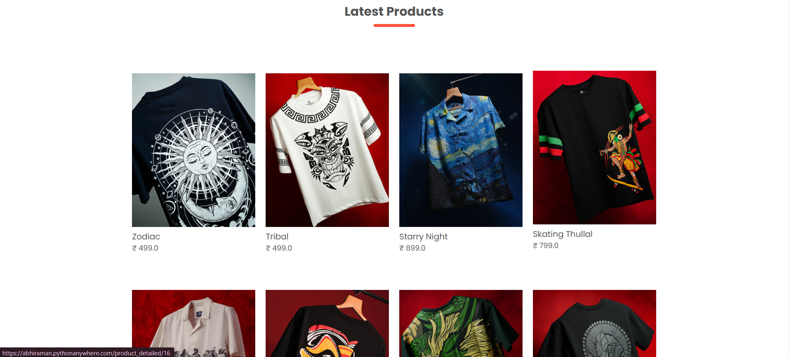
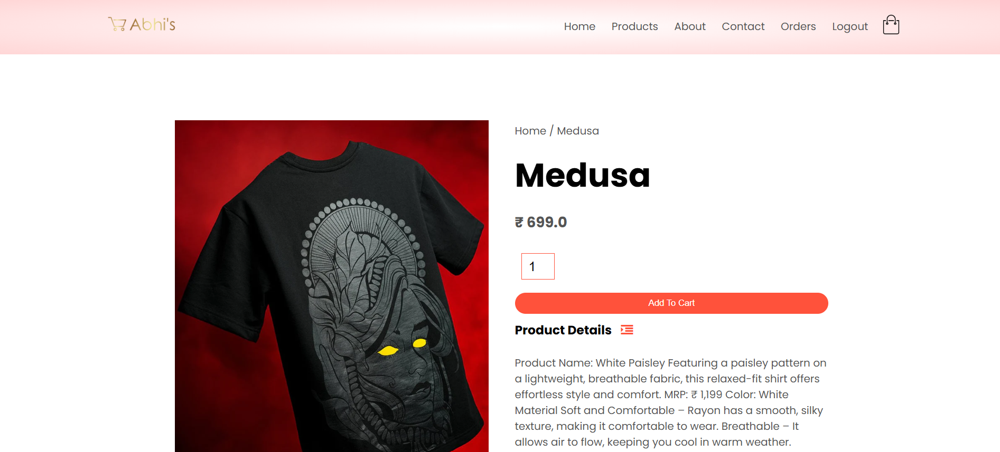
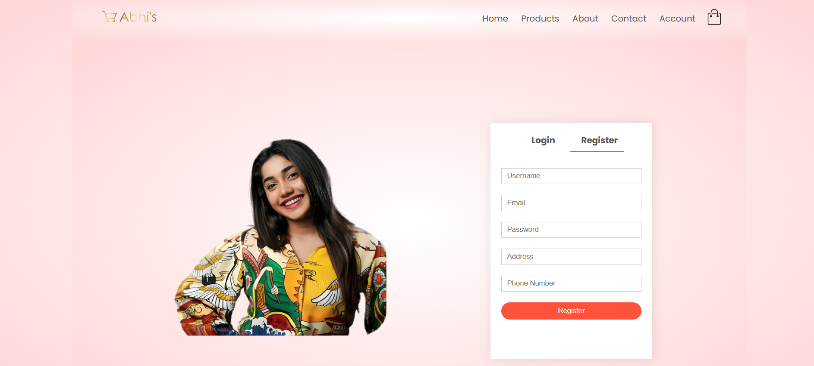
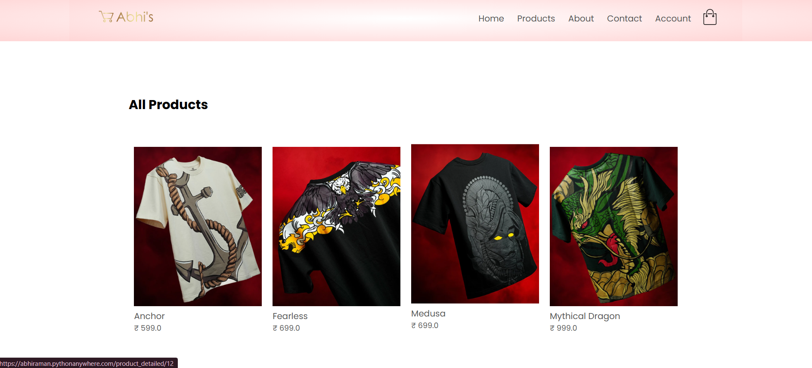
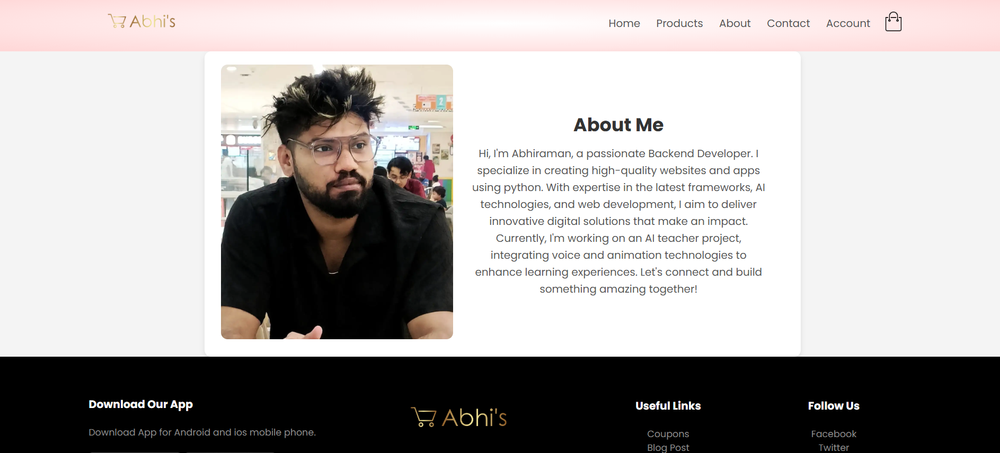

# Abhi's Ecommerce Website

Welcome to Abhi's Ecommerce Website, your one-stop destination for stylish and affordable fashion. Our mission is to make the pleasure and benefits of fashion accessible to everyone.


## Features

- **Home Page**: Showcases our latest collections and featured products.
- **Products Page**: Browse through our diverse range of products, including T-shirts, hoodies, and accessories.
- **About Page**: Learn more about our journey and values.
- **Contact Page**: Get in touch with us for any queries or feedback.
- **User Account**: Manage your profile, orders, and wishlist.

## Technologies Used

- **Frontend**: HTML, CSS, JavaScript
- **Backend**: Python (Django)
- **Database**: SQLite

## Installation

```bash
# Clone the repository
git clone https://github.com/ravitezabm/ecommerce.git
cd abhi-ecommerce

# Create a virtual environment
python -m venv env
source env/bin/activate  # On Windows, use 'env\Scripts\activate'

# Install dependencies
pip install -r requirements.txt

# Set up the database
python manage.py migrate

# Create a superuser (optional for admin access)
python manage.py createsuperuser

# Run the application
python manage.py runserver
```

Access the website at `http://127.0.0.1:8000/`.

## Screenshots

### Home Page




### Products Page



### Login Page



### Product Details



### About Page

screenshots/about.png

## Contributing

We welcome contributions to enhance our platform. Please fork the repository and create a pull request with your proposed changes.

## License

This project is licensed under the MIT License. See the [LICENSE](LICENSE) file for details.

## Contact

For any questions or feedback, please contact us at abhiramanrs200@gmail.com
images are copyrigted uploaded only for educational purposes, dm for removal

---


